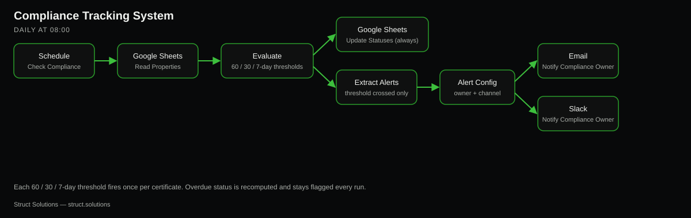

# n8n Compliance Tracking System

Tracks every property's Gas Safety, EICR and EPC renewal dates automatically, and fires alerts 60, 30 and 7 days before anything lapses — instead of an agency finding out a certificate expired when a landlord or tenant flags it.

Built by [Struct Solutions](https://struct.solutions), a UK-based AI automation consultancy — Module B of the Agency Operations System offer for estate/letting agencies, alongside the [Enquiry & Response System](https://github.com/StructUK/n8n-enquiry-response-system) reference build.

**This is a reference/demo build**, not a live client deployment. All data is simulated: fake properties, fake landlords, no real certificate-issuing body integration — expiry dates are seeded manually. See "Going live for a real agency" below for what changes.

## Why now

The **Renters' Rights Act** and **Making Tax Digital** are pushing UK letting agencies to actively prove compliance, not just claim it. Most smaller agencies still track Gas Safety, EICR and EPC renewal dates in a spreadsheet nobody checks proactively, or not at all — the first sign of a lapsed certificate is usually a landlord complaint, a tenant dispute, or a compliance audit, not an internal alert. This module closes that gap with almost no operational overhead: one daily check against a property list they already have.

## Who this is for

**Estate and letting agencies** managing a portfolio of rented properties, who are legally responsible for keeping Gas Safety, EICR and EPC certificates current and provable — which today means one person remembering to check a spreadsheet, or nobody checking at all until it's too late.

## How it works

### Daily (08:00)

- **Schedule Trigger** — runs once a day.
- **Google Sheets** ("Read Properties") — reads every property row.
- **Code** ("Evaluate Compliance") — for each property, for each of the three certificates (Gas Safety, EICR, EPC): computes `days_left` against today, derives `status` (`overdue` / `due_soon` / `valid`, recomputed every run so overdue stays visibly flagged rather than alerted once and forgotten), and works out whether a 60/30/7-day threshold was just crossed compared to the last threshold already alerted (`*_last_alert_days`) — each threshold fires at most once per certificate. This is the single place the alerting logic lives; everything downstream just consumes its output.
- **Google Sheets** ("Update Statuses") — always runs, writing the freshly computed status and last-alert fields back for every property, regardless of whether any alert fired this run.
- **Code** ("Extract Alerts") — flattens the per-property alert lists from the evaluation step into one item per certificate that just crossed a threshold. Empty on most days, by design.
- **Set** ("Alert Config") — the placeholder compliance-owner email and Slack channel, same config-node pattern as the Enquiry & Response build.
- **Send Email** + **Slack** ("Notify Compliance Owner") — fire in parallel for each alert, addressed to the placeholder compliance owner.

### Tracking view

A **Dashboard** tab in the same Google Sheet, formula-only: certificates due within 30 days, due within 60 days (both computed directly off the expiry-date columns, so they're never stale even between daily runs), and certificates currently overdue (off the status columns, refreshed daily).

## What it connects to

| Service | Used for | Required? |
|---|---|---|
| Google Sheets | property/certificate record store + dashboard | Yes |
| SMTP (email) | compliance owner notification | Optional (status tracking still works without it) |
| Slack | compliance owner notification | Optional (status tracking still works without it) |

No AI/LLM calls in this workflow — it's a pure scheduled evaluation/notification sequence.

## Setup

1. Create a Google Sheet with two tabs: `Properties` (header row: `property_ref, address, landlord_name, landlord_email, gas_safety_expiry, gas_safety_status, gas_safety_last_alert_days, eicr_expiry, eicr_status, eicr_last_alert_days, epc_expiry, epc_status, epc_last_alert_days`) and `Dashboard` (formulas above).
2. Import `workflow.json` into your n8n instance.
3. Add a Google Sheets credential (OAuth2 needs a Google Cloud project with the Sheets + Drive APIs enabled, and a Client ID/Secret) to both Google Sheets nodes, and point each `documentId` at your sheet.
4. Replace the placeholder `compliance_owner_email` and `slack_channel` values in the **Alert Config** node with your real compliance owner's inbox and Slack channel.
5. Add an SMTP credential to **Notify Compliance Owner (Email)**, and a Slack credential to **Notify Compliance Owner (Slack)** — both optional; leave either unconfigured and that branch simply won't fire.
6. Replace `notifications@struct.solutions` in **Notify Compliance Owner (Email)** with your own sending address.
7. Populate `Properties` with your real portfolio and their actual certificate expiry dates. Leave `*_status` and `*_last_alert_days` blank — the first run fills them in.
8. Activate the workflow.

### Manual acceptance test (do this after step 8)

1. Run the workflow manually (or wait for the daily trigger). Confirm every property row's status columns get filled in correctly against today's date.
2. Check the `Dashboard` tab's three counts match what you'd expect from your seeded/real data.
3. Edit one property's Gas Safety expiry date to 5 days from today, with `gas_safety_last_alert_days` blank. Re-run. Confirm an alert fires (email/Slack, if configured) and `gas_safety_last_alert_days` becomes `7`.
4. Re-run again without changing anything. Confirm no duplicate alert fires for that same property/certificate — this is the dedup behaviour the spec requires.
5. Edit the same certificate's expiry date to a date in the past. Re-run. Confirm `gas_safety_status` becomes `overdue` and stays that way on subsequent runs, whether or not a fresh alert fires.

### What's in this repo vs. what was configured live

Same approach as the Enquiry & Response build: this workflow was imported and saved on a live n8n instance (left deactivated) as part of putting it together, but the Google Sheets/Email/Slack credentials were deliberately **not** wired in — Google Sheets needs a Google Cloud OAuth client that only the account owner can create, and Email/Slack need real sending credentials that shouldn't be fabricated. The seed data, dashboard formulas, and Google Sheet itself are real and live at the document ID referenced in `workflow.json`, with statuses pre-computed by hand (since no credentialed execution ran against it). Steps 3–6 above are what's left to make the workflow actually run end-to-end.

## Going live for a real agency

To turn this into a real client deployment, an agency would need to provide:

- **Their actual property portfolio**: addresses, landlord contacts, and the real Gas Safety/EICR/EPC expiry dates for every managed property — this is the one-time data entry cost of adopting the system.
- **A real compliance owner or rota**: a single placeholder contact becomes proper routing (which staff member owns compliance, escalation if unactioned after N days).
- **A real SMTP account and Slack workspace**, provisioned for the agency.
- **A process for keeping expiry dates current** as certificates get renewed — either manual updates to the sheet after each renewal, or (longer-term) integration with whichever certification provider/engineer the agency uses.

This build deliberately has no integration with an actual certificate-issuing body or provider — that's a real API integration decision specific to each agency's suppliers, out of scope for a reference build.
